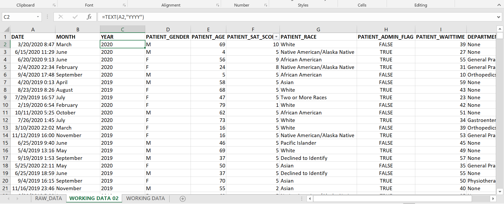

# HOSPITAL-ER OPERATION ANALYSIS

***

## Introduction
***

This is an Excel and Power Bi project on operation analysis of a company in healthcare called "Hospital Er(emergency room)". This project is to analyze and derive insights to answer essential questions to enable the company make data driven decisions.

***_Disclaimer_*** : _All datasets and report do not represent any company, institution or country, but just a dummy dataset to demonstrate the capabilities of Excel and Power Bi_.

## Problem statement
***
Hospital ER (emergency room) is a company that operates in the healthcare industry in the United Region. The company which has 3 branches and still expanding, however is facing challenges in keeping track of its operations and capacities over the years.

As a Data Analytics Consultant, I was handed the responsibility to uncover insights from the dataset provided, make recommendations that will improve the efficiency of the company and provide answers to the business questions asked below:

1.	What is the total number of patients admitted in each year? Has admission been on the increase or decrease?
2.	What is the average customers wait-time over the years?
3.	Which of the month have the highest and lowest admission rate over the years?
4.	Which of the age group are highly admitted over the years?
5.	Which of the races have the highest and lowest admission rate in the year 2020?
6.	Which of the referral departments have the highly admitted patients over the years?
7.	Other insight(s) uncovered?

## Data Sourcing
****
The dataset was provided by Real World Fake Data. Click [HERE](https://data.world/markbradbourne/rwfd-real-world-fake-data/workspace/file?filename=Hospitality.csv) to access the dataset.

## Skills / Concepts demonstrated:
***
The skills demonstrated on this project were :

- Data cleaning ,
-	Data transformation ,
-	Data Analysis ,
-	Data Visualization .

## Data Transformation
***

The date column comes with a date-time datatype. In other to extract the months and years which will be needed for the analysis, it was hereby transformed.

__Month Extraction__

__Year Extraction__

__Age group__

The patient age column contains numerous ages which were grouped for simplicity and understanding as follows;

- < 1yr = Infant.
- 1-12yrs = Children.
- 13-17yrs = Teenager.
- 18-65yrs = Adult.
- 65yrs and above = Older adult.
  
 

 ## Visualization:
 ***
 
 Kindly interact with the report [HERE](https://app.powerbi.com/view?r=eyJrIjoiZDY4Yjk2YmYtMWUwOC00ZjkxLWJmNDQtYzQzODJkOTQ2MzgzIiwidCI6ImRiNGMyY2U5LWM5NWYtNDE3Mi05ZThkLTQ1ODAxZmEwMjE3NyJ9).
The Dashboard can be filtered using the Year and the Gender by the top right corner of the page.
Note for the gender ;
- M = Male
- F = Female
- N = Non-conforming.

## Analysis
***
1. The total number of patients admitted over the years are __4337__ and __4878__ in the year 2019 and 2020 respectively. Yes , admission had been on the increase in the year 2020 by __6%(541 patients)__.
2. An average customer waited for __35.03 mins__ in 2019 and __35.47 mins__ in 2020 before been attended to by a doctor.
3. Admission is on the highest in 2019 on the month of __June(505 patients)__ and lowest in the month of __July(464 patients)__ and __November(464 patients)__ .
In 2020, admission is on the highest In the month of __August(530 patients)__ and lowest in the month of __February(431 patients)__ .
4. Adults(18-65yrs) are highly admitted in the year 2019 and 2020 having 2655 and 2972 patients respectively.
5. In 2020, Patients from __White race(1346)__ are highly admitted while __Native America/Alaska Native(262)__ are least admitted.
6. Over the years,patient who were'nt referred from any department(None) were admitted the most.
7. It is surprising😲😲😲 that no patient was admitted into the hospital for the first 3 months of the year 2019 consecutively (January, February and march) which resulted in the decrease of the total patientS admitted, which is unusual in a hospital.

## CONCLUSIONS AND RECOMMENDATIONS
***
•	Data on satisfaction score and reason(s) behind satisfaction score filled should be collected from discharged patients. This will help to uncover the root cause of the score filled.

•	Measures to reduce patients wait-time should also be put in place, this might help to improve patient satisfaction score also.

•	Data on hospital location and location of the patients should be collected. This will further help to study and analyze how KPI varies among locations.

•	The reason(s) why no patient was admitted for the first 3 months of the year 2019 into the hospital should be investigated as well. 

# THANK YOU🥰🥰🥰
 
 

